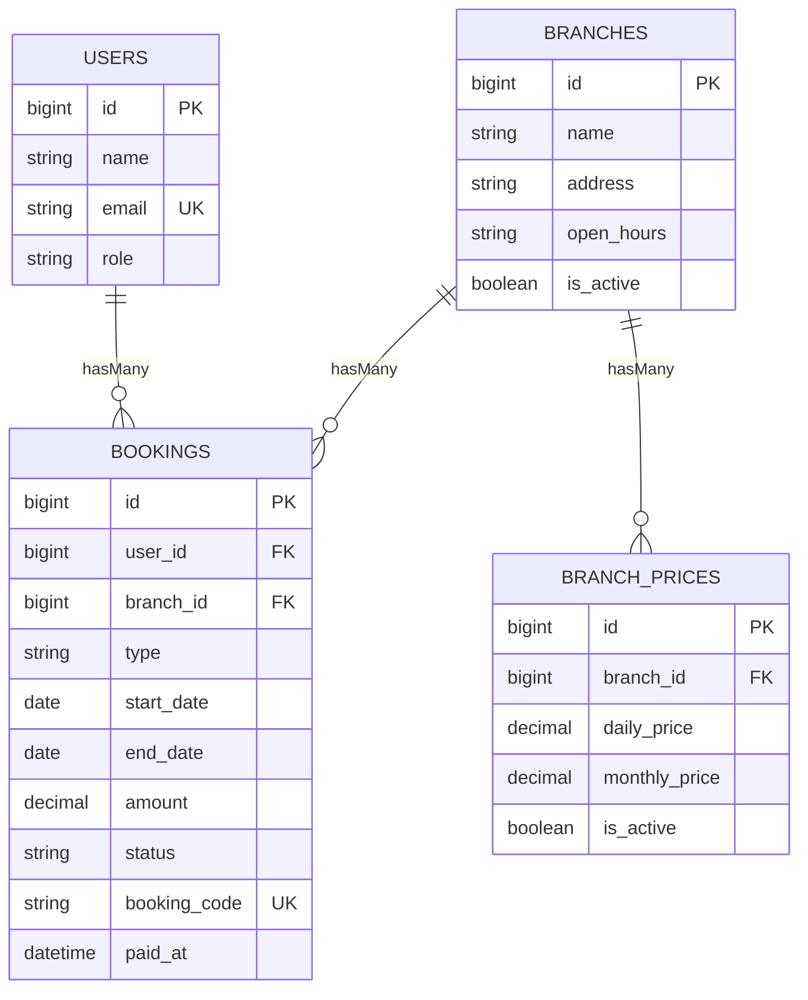

# ERD – Sistem Booking Gym/Fitness

## Entitas & Atribut

### `users`

-   `id` (PK)
-   `name`
-   `email` (unique)
-   `email_verified_at` (nullable)
-   `password`
-   `role` (`admin|member`, default `member`)
-   timestamps

### `branches`

-   `id` (PK)
-   `name`
-   `address`
-   `open_hours` (string)
-   `is_active` (bool)
-   timestamps

### `branch_prices`

-   `id` (PK)
-   `branch_id` (FK -> `branches.id`)
-   `daily_price` (decimal)
-   `monthly_price` (decimal)
-   `is_active` (bool)
-   timestamps

### `bookings`

-   `id` (PK)
-   `user_id` (FK -> `users.id`)
-   `branch_id` (FK -> `branches.id`)
-   `type` (`daily|monthly`)
-   `start_date` (date)
-   `end_date` (date)
-   `amount` (decimal)
-   `status` (`PENDING|PAID|CANCELED|EXPIRED`)
-   `booking_code` (unique, nullable; terisi saat PAID)
-   `paid_at` (nullable)
-   timestamps

## Relasi

-   **User hasMany Bookings**: `users.id` -> `bookings.user_id`
-   **Branch hasMany Bookings**: `branches.id` -> `bookings.branch_id`
-   **Branch hasMany BranchPrices**: `branches.id` -> `branch_prices.branch_id`
-   **Branch hasOne active BranchPrice**: `branch_prices.is_active = 1`
-   **Booking belongsTo User & Branch**

## Aturan Integritas (DB + Aplikasi)

-   **Daily double booking**: unik untuk kombinasi `(user_id, branch_id, type, start_date)`
-   **Monthly overlap**: dicegah di level aplikasi menggunakan query overlap dalam **DB transaction** (dengan `lockForUpdate()`), karena MySQL tidak punya exclusion constraint bawaan.
-   **Satu harga aktif per cabang**: ditegakkan via logika aplikasi (deactivate harga lain saat mengaktifkan) + indeks unik berbasis kolom generated (nullable) agar hanya 1 baris aktif per branch.

## Diagram (Mermaid)

